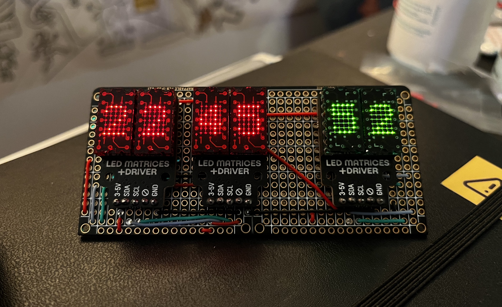

# esphome-microdot-matrix

A custom component for `esp-home` to drive the beautiful `LTP305` based LED Matrices from Pimoroni.
They produce this module in two forms, a standalone [LED Matrix Breakout][matrix_url] containing
two display modules, and a Raspberry Pi HAT called Microdot pHAT.

I really love these little displays, but I wanted to free up some of my old Raspberry Pis driving
this display (thanks to the global shortage), and so I decided to make them work with ESP-Home, which
has a great API.



### Notes
- Reviewing [`max7219digit`][max7219] implementation, I discovered that we can have custom functions
  in lambdas. This works by passing the `MicrodotMatrix` object to the lambda instead of just the
  `DisplayBuffer`.
- Based on Pimoroni's [original implementation][pimoroni_pico], and most importantly the font.
- You can use any font (or anything really that is suppored by esp-home's display api), but most pixel
  fonts I found did not render nicely.
- Pimoroni's font is accessible by using `printstr`, `printchar`, and `printstrf`, while you can
  use your own font via `printf` api.
- If you use multiple displays, be aware that there is a noticable refresh delay between them. (I might
  improve this later.)
- Red and Green modules do not have same brightness scale.
- Logically you have 10 x 7 pixels grid, but there is a gap between 5th and 6th pixels.

## Usage

Include the component in your `esp-home` config. You can either link directly
to this repo or clone it and include locally (example below). Refer to docs
for the config via git repos.

```yml
external_components:
  - source:
      type: local
      path: esphome-microdot-matrix
```

Next add the following configuration, which will show current time (...well,
seconds) and pulse the brightness (approximately) every second.

There are a couple of functions available in lambda, namely, `printstrf(format, ...)`,
`set_decimal(left, right)`, and `set_brightness(value)`.

```yml
time:
  - platform: sntp
    id: ntp_time
    timezone: 'Europe/Paris'

display:
  - platform: microdot_matrix
    update_interval: .5s
    address: 0x61
    brightness: 10
    lambda: |-
      auto time = id(ntp_time).now();
      it.printstrf("%02d", time.second);
      if (time.second % 2) {
        it.set_brightness(20);
        it.set_decimal(true, true);
      } else {
        it.set_brightness(10);
        it.set_decimal(true, true);
      }
```

## Todos

- [ ] Scroll support
- [x] Use Pimoroni's fonts
- [ ] Weather Icons
- [ ] Support more fonts?

## License

MIT.

[matrix_url]: https://shop.pimoroni.com/products/led-dot-matrix-breakout?variant=32274405621843
[max7219]: https://github.com/esphome/esphome/blob/ecac26aebaa7aa8c27f58be2fa6a1330f92bc92d/esphome/components/max7219digit/display.py
[pimoroni_pico]: https://github.com/pimoroni/pimoroni-pico/blob/main/drivers/ltp305/ltp305.cpp
